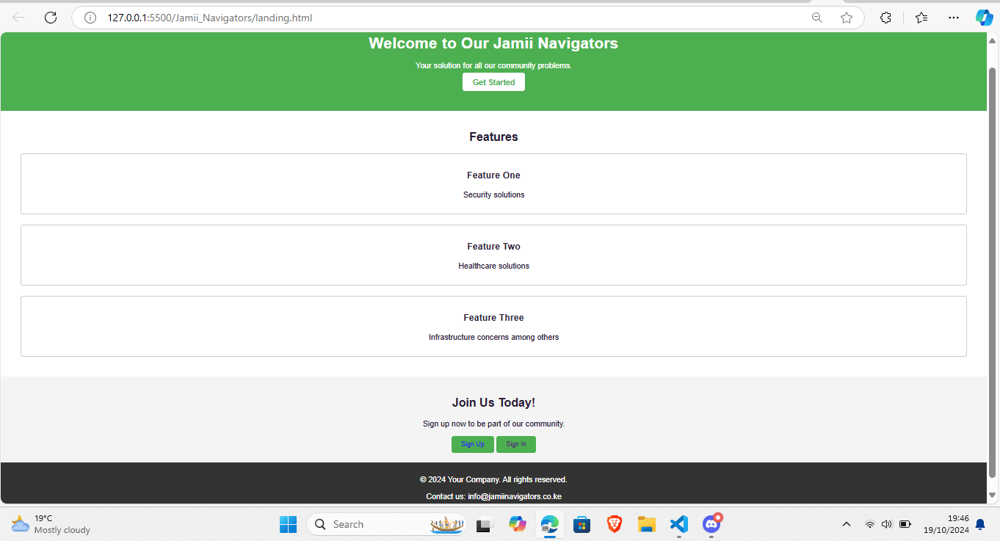
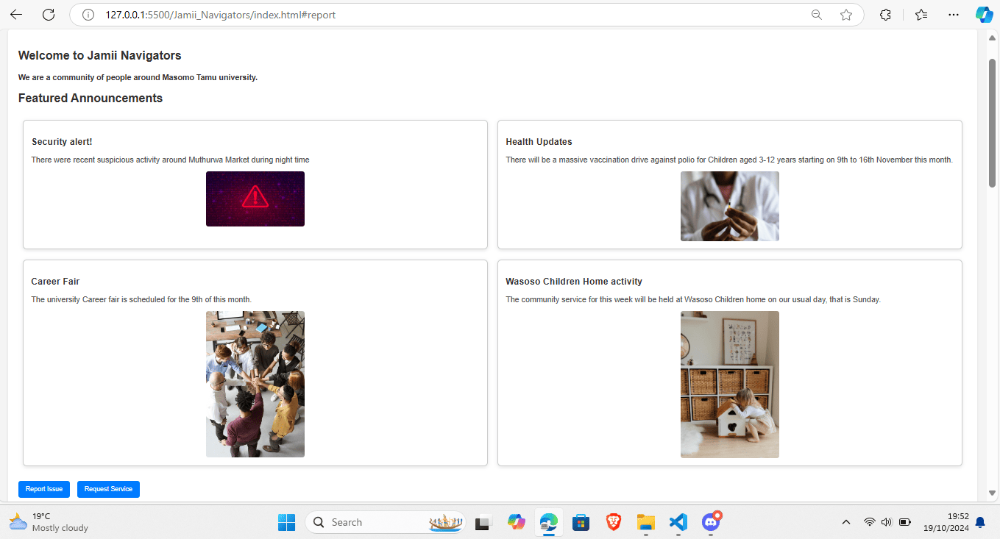
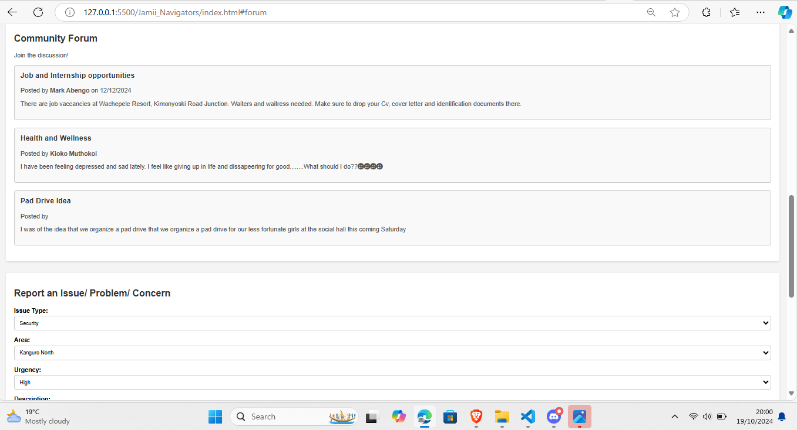
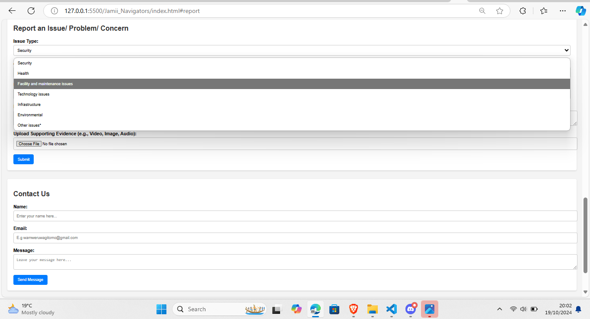
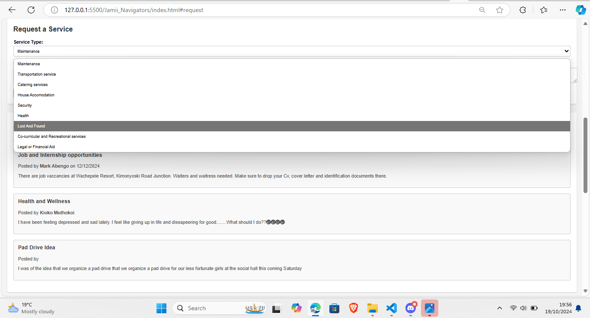
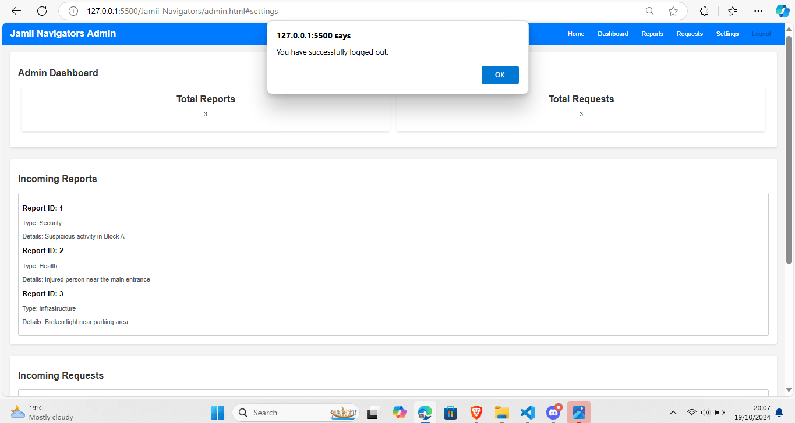
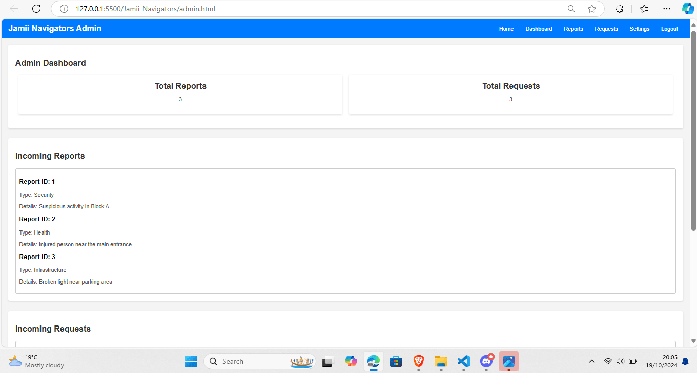

# Jamii Navigators
Jamii Navigators is a community-driven web and mobile platform designed to facilitate seamless communication between community members and local authorities or organizations. Focused on enhancing engagement within university communities, it allows users to request services, report issues, and ask for information in real time. With an intuitive user interface and a robust backend, Jamii Navigators ensures that community issues are addressed efficiently while promoting transparency and accountability.

## Project Overview
Jamii Navigators was developed to solve the communication challenges between community members and local authorities, particularly within universities. Students, staff, and other members often face difficulties in reporting issues or requesting services, which can lead to unaddressed concerns. Jamii Navigators aims to bridge these gaps by providing a streamlined solution for reporting and resolving community issues efficiently. By leveraging technology, we are building a more responsive and accountable community environment.
Key Features
### 1. User Authentication:
   - Users can create accounts, log in, and track their requests or reports.
   - Authorities have separate access to monitor and respond to issues.
### 2. Issue Submission Forms:
   - Users can easily submit requests for services, report problems (e.g., maintenance issues, security concerns), or ask for information.
   - Issue categories help streamline the process and ensure requests go to the right department.
### 3. Notification System:
   - Users receive real-time notifications on the status of their submissions, including updates and resolutions from local authorities.

### 4. Dashboard for Authorities:
   - A dedicated panel for local authorities to manage requests, respond to issues, and update statuses.
   - Data visualization tools to display trends, most reported issues, and service response times.
### 5. Data Visualization:
   - Graphs and charts help authorities analyze the trends in community reports, enabling data-driven decision-making.
### 6. Crisis Management Module:
   - Allows users to report emergencies, such as security threats or health concerns, with priority notifications for immediate action.
### 7. Community Feedback Loop:
   - Users can provide feedback on the quality of services and issue resolution, fostering a transparent and accountable environment.
## How Jamii Navigators Addresses Issues Holistically
Jamii Navigators addresses several core challenges in community engagement by offering a platform that focuses on clear, fast, and efficient communication:
- Accessibility: By providing both a mobile and web application, Jamii Navigators ensures that users can report issues or request services anytime, anywhere.
- Streamlined Communication: Through dedicated channels for various categories of requests (e.g., maintenance, security, information), Jamii Navigators makes it easier for community members to communicate with the right authorities.
- Accountability: The dashboard for authorities not only helps track and manage requests but also provides transparency. Users can see updates and responses to their issues, which holds the authorities accountable.
- Real-Time Updates: With the notification system, users are kept informed on the progress of their submissions without needing to follow up, reducing frustration.
- Data-Driven Insights: The platform provides data visualization tools for authorities to analyze common issues and trends, enabling proactive solutions rather than reactive ones.

# Jamii Navigators Benefits

- Improved Communication and Engagement: Jamii Navigators enhances the interaction between community members and authorities, making it easier for concerns to be raised and resolved in a timely manner.
- Increased Efficiency in Problem Solving: The streamlined processes reduce delays, ensuring that issues are quickly addressed. Users are kept informed throughout the entire process, improving their experience.
- Data-Driven Decision Making: The platform allows authorities to analyze reported issues, identify trends, and prioritize resources more effectively, ensuring that critical problems are dealt with first.
- Enhanced Transparency and Trust: By providing real-time updates and a feedback loop, Jamii Navigators fosters a culture of accountability, where community members trust that their concerns will be taken seriously and addressed properly.
- Proactive Crisis Management: The crisis management module ensures that in emergencies, authorities are alerted immediately, allowing for quicker response times and improved safety.*
# Explanation
## Jamii Navigators Appendices
 
 
 
 
 
 
 

